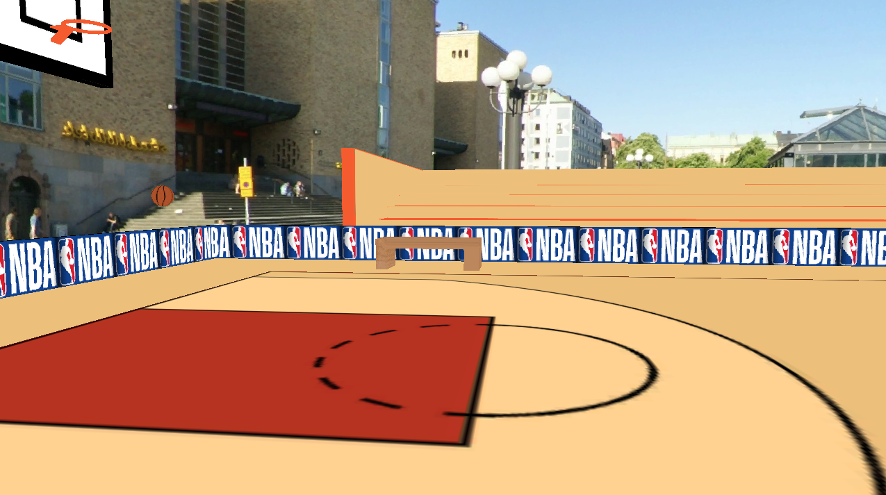
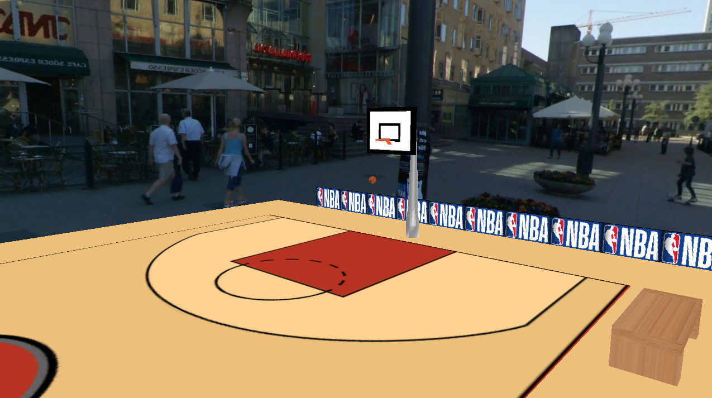
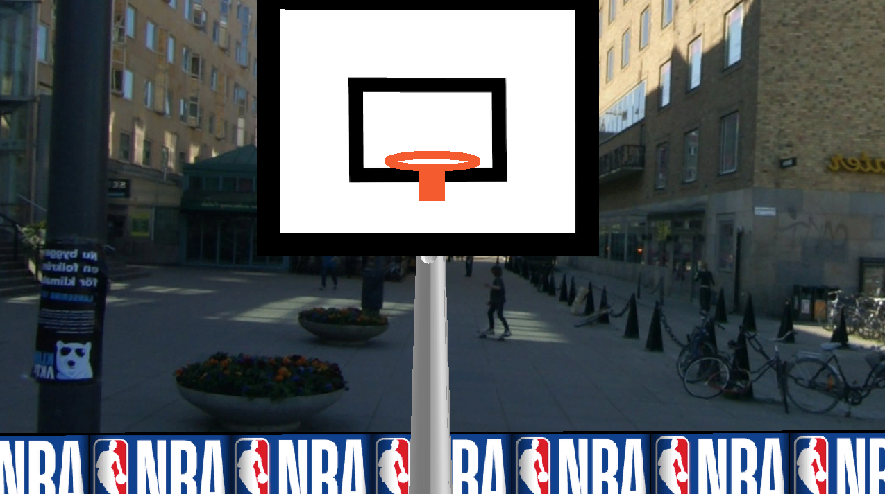

# BilgisayarGrafikleriProje2

## Kurulum ve Çalıştırma
```bash
cd ProjeDosyalari
cd build
rm -rf CMakeCache.txt CMakeFiles/ ## Eğer başka bir bilgisayardan kalma cache varsa
./run.sh
```
run.sh çalıştırılırken kütüphane hataları almanız durumunda sudo apt install <kütüphane adı> şeklinde kurulumları halledebilirsiniz. Eğer kütüphane bulunamadı diyorsa ChatGPT ye hatayı atarsanız hangi kütüphaneye ihtiyacınız olduğunu size söyleyecektir.

## Rapor
Rapor.pdf içerisinde gerekli rapor ve detaylar bulunmaktadır. ([Rapor Dosyası](Rapor.pdf))

## Video
1 dakikalık tanıtım videosuna aşağıdaki linkten ulaşabilirsiniz:
https://www.youtube.com/watch?v=dbbXdxtLa98

## Kullanım

Serbest Kamera Modu (Default):
- WASD ile kamera hareketleri
- Fare ile dönme hareketleri
- F ile FPS moda geçiş
- ESC ile kapama

FPS Modu:
- Fare ile sağa ve sola bakış
- F ile Serbest Moda Geçiş
- ESC ile kapama


## 3 Adet Ekran Görüntüsü



